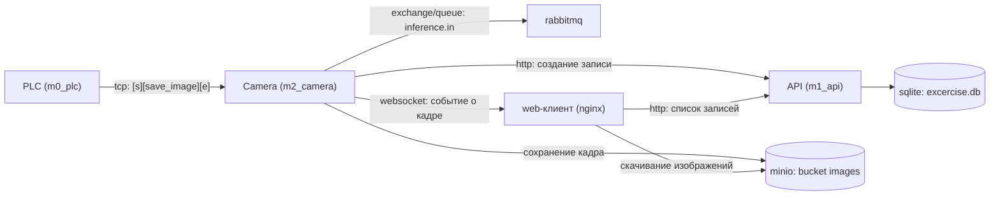

# robotech

## Задача
Написать два сервиса: ```api``` и ```camera``` (это часть `inference service`, по схеме, а для упрощения сервис камеры напрямую подключается к PLC).
HLD *реальной* системы:  


### Сценарий  

1. [PLC](old/server.py) отдает команду tcp клиенту о том, что некий объект на линии подъезжает к камере и пора делать фотографию.   

2. [Camera] имитирует работу с реальной камерой: просто читает изображение из папки проекта, по триггеру tcp сервера (PLC). Затем создает сущность объекта в базе данных (при помощи запроса в api), сохраняет изображение в объектное хранилище, и отправляет данные в очередь. В примере - выход подается на очередь `inference.in` (для дальнейшей обработки изображения, которое в тестовом не покрывается), а также отправляет в [websocket-client](old/client.py) (заменяет frontend) сообщение о "захваченом" кадре.  

3. [CRUD API] Скрывает работу с БД, и имеет публичные ресурсы создания, просмотра и изменений сущностей в БД. В нашем случае, чтобы не плодить таблицы - все "ручки" должны быть написаны для сущности одного обрабатываемого объекта (без пользователей, сессий и пр. не покрытых заданием вещей).  


### API  

Простой api, с 3 ручками:  
  * Добавление записи в бд  
  * Поиск записи по id  
  * Список всех записей  
 
База данных ```sqlite``` находится в ```./excercise.db``` и содержит следующие 4 поля:  
  * ```id```  
  * ```image_url``` (ссылка на изображение, сохраненное в minio)  
  * ```width``` (ширина изображения в px)  
  * ```height``` (высота изображения в px)  

### Camera

Ключевой компонент системы.  
Сервис, имитирующий работу с камерой должен включать в себя:  
  * tcp клиент, который подключается к серверу (порт вы можете найти в ```.env```)  
  * websocket server для транслирования данных на клиент  
  * работу с rabbitmq, minio и api  

При получении от tcp сервера сообщения ```[s][save_image][e]``` вы должны:  
  * Взять изображение из ```./backend_test/```  
  * Сохранить его в minio  
  * Сохранить данные об изображении в sqlite (ts, размеры, и тд.), через запрос к api  
  * Отправить сообщение, содержащее ссылку на изображение в minio, в формате json ws клиенту  
  * Отправить такое же сообщение в rabbitmq (`exchange` и `routing_key` - ```inference.in```)  

### Docker и docker-compose

Вся система, в тч бд и очереди, запускается через docker-compose. Подразумевается что имплементированные Вами сервисы тоже используют docker, и запускаются из того же docker-compose файла в корне проекта.  

## Требования  
  * Используйте ```python```
  * Старайтесь использовать минимум сторонних библиотек  
  * Проект должен быть небольшим, но структурированным  
  * При взаимодействии с БД используйте SQL, без сложных ORM.  
  * Для удобства тестирования и демонстрации - имплементируйте простой web-клиент, где можно скачивать изображения и просматривать события полученные по ws.
  * Предложите улучшения существующей архитектуры  
  * Добавить интеграционные тесты для базовых сценариев взаимодействия сервисов  
  * Сопроводите ваше решение небольшой секцией в ```README.md```: ньюансы имплементации, особая инструкция по запуску и тестам и тд.  

## Запуск

```bash
$ docker compose up -d
```

### Остановка

```bash
$ docker compose down
```

## Решение

### Архитектура



- `modules/m0_plc` — эмулятор PLC: TCP-сервер, шлёт `[s][save_image][e]` каждые `PLC_INTERVAL_SEC` секунд. Только stdlib.
- `modules/m1_api` — CRUD API (FastAPI + uvicorn, sqlite3 на чистом SQL, без ORM): `POST /images/`, `GET /images/{id}`, `GET /images/`.
- `modules/m2_camera` — сервис камеры: tcp-клиент к PLC, websocket-сервер, по триггеру сохраняет кадр в minio, создаёт запись через api, рассылает json-сообщение ws-клиентам и в очередь `inference.in`.
- `docker/` — Dockerfile'ы сервисов и web-клиент (nginx + статическая страница).
- `tests/` — `unit` (pytest) и `it` (testcontainers).


### Запуск

```bash
$ docker compose up -d --build
```

После старта:
- web-клиент: http://localhost:8080 (лента событий по ws + список записей со ссылками на скачивание);
- api: http://localhost:8000/docs (Swagger UI);
- RabbitMQ management: http://localhost:15672 (guest/guest);
- MinIO console: http://localhost:9001 (minioadmin/minioadmin).

Порты и креды настраиваются в `.env` (compose подхватывает его автоматически).

### Запуск в dev-режиме

`docker-compose.dev.yaml` поднимает инфраструктуру (rabbitmq + minio) и web-клиент (http://localhost:8080 — в dev он проксирует `/api/` на `host.docker.internal:8000`, где работает локально запущенный api). Сервисы запускаются локально из venv каждого модуля и подключаются по localhost (дефолты env уже на это рассчитаны):

```bash
# инфраструктура
$ docker compose -f docker-compose.dev.yaml up -d

# сервисы — каждый в своём терминале (Windows; на linux: .venv/bin/python)
$ modules/m0_plc/.venv/Scripts/python modules/m0_plc/main.py
$ cd modules/m1_api && .venv/Scripts/python main.py          # api на :8000
$ cd modules/m2_camera && .venv/Scripts/python main.py       # нужен backend_test: IMAGES_DIR=../../backend_test
```

Дефолты env в коде модулей совпадают с `.env`, поэтому экспортировать переменные вручную не нужно.

Если venv модулей ещё не созданы (у plc зависимостей нет):

```bash
python -m venv modules/m1_api/.venv && modules/m1_api/.venv/Scripts/pip install -r modules/m1_api/requirements.txt
python -m venv modules/m2_camera/.venv && modules/m2_camera/.venv/Scripts/pip install -r modules/m2_camera/requirements.txt
```

Для camera при запуске из папки модуля задайте `IMAGES_DIR=../../backend_test` (или запускайте из корня репозитория).

Остановка инфраструктуры: `docker compose -f docker-compose.dev.yaml down`.

### Остановка

```bash
$ docker compose down        # добавьте -v, чтобы удалить данные minio/rabbitmq
```

### Тесты

```bash
# один раз: создать venv для тестов
python -m venv tests/.venv
tests/.venv/Scripts/pip install -r tests/requirements.txt   # Windows; на linux: tests/.venv/bin/pip

# прогон (из корня проекта)
tests/.venv/Scripts/python -m pytest tests/unit -v   # unit: CRUD api, разбор png, FrameSource
tests/.venv/Scripts/python -m pytest tests/it -v     # integration: testcontainers (minio + rabbitmq)
```

Интеграционный тест поднимает реальные minio/rabbitmq в контейнерах (первый прогон тянет образы), api — через uvicorn с временной БД, PLC заменён фейковым TCP-сервером; проверяется вся цепочка: триггер → запись в БД → объект в minio → сообщение в ws и в очереди `inference.in`.

### Нюансы

- Образы minio в `.env` параметризованы: канонические `minio/minio` и `minio/mc` в некоторых регионах недоступны для pull (блокировка на стороне registry), поэтому по умолчанию используются `bitnamilegacy/minio` и `bitnamilegacy/minio-client` — API-совместимые сборки. Если registry доступен, достаточно поменять `MINIO_IMAGE`/`MC_IMAGE` в `.env`.
- БД sqlite монтируется в контейнер api как файл (`./excercise.db:/data/excercise.db`); таблица `images` создаётся при старте, если её нет (`CREATE TABLE IF NOT EXISTS`).
- Сообщение в ws/rabbitmq: `{"id", "image_url", "width", "height", "ts"}`.
- `image_url` — публичная ссылка minio (`mc anonymous set public` делает bucket доступным на чтение), поэтому web-клиент показывает/скачивает кадры напрямую.
- При смене `WS_PORT` поправьте порт в `docker/web/static/index.html` (ws подключается с хоста напрямую).

### Предложения по улучшению архитектуры

1. **Идемпотентность пайплайна**: сейчас повторный триггер создаёт дубликат записи.
2. **Миграции БД** (flyway/alembic) вместо `CREATE TABLE IF NOT EXISTS` при старте приложения.
3. **Отдельный inference-консьюмер** очереди `inference.in` (в ТЗ опущен).
4. **Наблюдаемость**: настроить Loki, Grafana, метрики Prometheus.
5. **Graceful shutdown**: обработка SIGTERM во всех сервисах (сейчас корректно закрывается только при управляемой остановке).
6. **Конфигурация через pydantic-settings** вместо ручного чтения env, если настроек станет больше.
7. sqlite → postgres при росте нагрузки: слой БД в api уже изолирован в `db.py`.
8. добавить больше тестов (покрытие 100%)
9. сделать лучше web-страницу
10. скрыть env-файлы (для безопасности) 
11. добавить авторизацию
